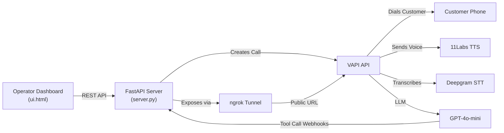

# Sunrise Warm Follow-Up Voice Agent — Implementation Plan

A VAPI-powered voice agent system that performs warm follow-up calls with real estate customers on behalf of a Mumbai broker, guiding them toward booking an office visit.

## Architecture Overview



## Source Files (from MD specifications)

| Spec File | Output File | Purpose |
|---|---|---|
| [server.md](file:///d:/hackathon/realEstate/brokerAssistant/working/src/WarmFollowUp/server.md) | `server.py` | FastAPI backend — VAPI call orchestration, webhook handlers, lead/booking CRUD |
| [prompt.md](file:///d:/hackathon/realEstate/brokerAssistant/working/src/WarmFollowUp/prompt.md) | `prompt.md` (kept as-is) | VAPI system prompt — warm follow-up conversation script with template variables |
| [env.md](file:///d:/hackathon/realEstate/brokerAssistant/working/src/WarmFollowUp/env.md) | `.env.example` | Environment variable template for API keys and config |
| [ui.html](file:///d:/hackathon/realEstate/brokerAssistant/working/src/WarmFollowUp/ui.html) | `ui.html` | Operator dashboard — will be upgraded to a premium design |

## User Review Required

> [!IMPORTANT]
> **API Keys**: The system requires a VAPI API key and phone number ID to make actual calls. The `.env.example` file will have placeholder values. You'll need to fill in real credentials before testing.

> [!IMPORTANT]
> **ngrok**: Without an ngrok auth token, VAPI cannot reach the local webhook endpoints (book_appointment, log_call_outcome). The tool calls will silently fail. A free ngrok token is strongly recommended.

> [!WARNING]
> **Phone Costs**: Each VAPI call to a real phone number costs money (VAPI credits + Twilio telephony). For testing, consider using the VAPI web call feature or a test phone number.

## Open Questions

> [!IMPORTANT]
> **Broker Details**: The server has hardcoded broker config (Ajit Jawale, Sunrise Properties, Mumbai). Should these remain as-is for the hackathon demo, or do you want them configurable via the UI?

> [!IMPORTANT]
> **LLM Model**: The spec uses `gpt-4o-mini`. Would you prefer a different model (e.g., `gpt-4o` for higher quality, or a different provider)?

> [!NOTE]
> **Voice**: The spec uses ElevenLabs `sarah` voice with `eleven_turbo_v2_5`. The transcriber is Deepgram `nova-2` with Hindi language. Are these acceptable, or do you want to change the voice/language settings?

---

## Proposed Changes

### Backend Server

#### [NEW] [server.py](file:///d:/hackathon/realEstate/brokerAssistant/working/src/WarmFollowUp/server.py)

The Python code from `server.md` will be extracted into a working `server.py` file. Key components:

- **Broker Config** — Hardcoded: Ajit Jawale, Sunrise Properties, Mumbai
- **Lead Management** — JSON file-based CRUD (`leads.json`): add single, bulk CSV upload, clear, list
- **VAPI Call Orchestration** — Build transient assistant config per call with injected prompt variables, single-call and batch-dial with stagger
- **Webhook Handlers** — `/tool/book_appointment` and `/tool/log_call_outcome` endpoints that VAPI calls during conversations
- **ngrok Tunnel** — Auto-establishes public URL so VAPI can reach webhooks
- **Dynamic Context** — IST timezone, auto-computed weekend slots, date injection into prompt

---

### Environment Configuration

#### [NEW] [.env.example](file:///d:/hackathon/realEstate/brokerAssistant/working/src/WarmFollowUp/.env.example)

Template with placeholder values for:
- `VAPI_API_KEY` — Private API key from VAPI dashboard
- `VAPI_PHONE_NUMBER_ID` — Phone number ID (not the number itself)
- `NGROK_AUTHTOKEN` — Optional but recommended
- `PORT` — Default 8000

---

### Python Dependencies

#### [NEW] [requirements.txt](file:///d:/hackathon/realEstate/brokerAssistant/working/src/WarmFollowUp/requirements.txt)

```
fastapi
uvicorn
requests
python-dotenv
pyngrok
python-multipart
```

---

### Operator Dashboard (Premium Upgrade)

#### [NEW] [ui.html](file:///d:/hackathon/realEstate/brokerAssistant/working/src/WarmFollowUp/ui.html) (overwrite existing)

The existing `ui.html` is functional but has a basic/minimal design. I will upgrade it to a **premium, modern dashboard** with:

- **Dark theme** with glassmorphism cards and subtle gradients
- **Animated sidebar** or header with broker branding (Sunrise Properties)
- **Real-time stats banner** — total leads, pending, called, booked counts with animated counters
- **Lead table** with hover effects, smooth status transitions, and action buttons
- **Booking feed** with timeline-style cards and outcome badges
- **CSV upload** with drag-and-drop zone and visual feedback
- **Call controls** with confirmation modals and progress indicators
- **Micro-animations** — fade-ins, slide transitions, pulse effects on live updates
- **Google Fonts** (Inter) for premium typography
- **Responsive layout** — works on desktop and tablet
- All existing API functionality preserved (add lead, CSV upload, call, batch call, bookings)

---

## Verification Plan

### Automated Tests

1. **Server Startup**:
   ```bash
   cd d:\hackathon\realEstate\brokerAssistant\working\src\WarmFollowUp
   python server.py
   ```
   Verify: Server starts on port 8000, ngrok tunnel prints (if token set), browser opens

2. **API Endpoints** (via browser/curl):
   - `GET /` → Dashboard loads with premium UI
   - `GET /api/context` → Returns broker config + computed dates
   - `POST /api/leads/add` → Adds lead to `leads.json`
   - `GET /api/leads` → Returns lead list
   - `GET /api/bookings` → Returns booking list

3. **UI Functionality**:
   - Add a test lead manually
   - Verify lead appears in table
   - Verify context banner shows broker info and computed slots
   - Verify bookings section updates

### Manual Verification

- **Full call test** (requires real VAPI credentials): Add a real phone number as a lead, trigger a call, verify the agent speaks the warm follow-up script, and verify webhook data flows back to bookings
