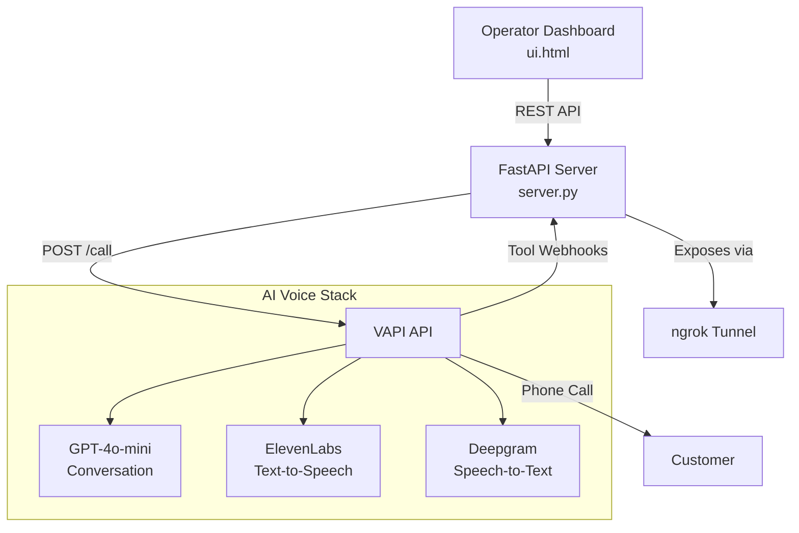

# Sunrise Warm Follow-Up Voice Agent — Walkthrough

## What Was Built

A complete **VAPI-powered voice agent system** that performs warm follow-up phone calls with real estate customers on behalf of broker Ajit Jawale (Sunrise Properties, Mumbai). The agent guides customers toward booking an office visit.

## Architecture



## Files Created

| File | Purpose |
|---|---|
| [server.py](file:///d:/hackathon/realEstate/brokerAssistant/working/src/WarmFollowUp/server.py) | FastAPI backend — VAPI orchestration, lead/booking CRUD, webhook handlers |
| [ui.html](file:///d:/hackathon/realEstate/brokerAssistant/working/src/WarmFollowUp/ui.html) | Premium dark-themed operator dashboard with glassmorphism, animations, toast/modal systems |
| [.env.example](file:///d:/hackathon/realEstate/brokerAssistant/working/src/WarmFollowUp/.env.example) | Environment variable template for API keys |
| [requirements.txt](file:///d:/hackathon/realEstate/brokerAssistant/working/src/WarmFollowUp/requirements.txt) | Python dependencies |
| [prompt.md](file:///d:/hackathon/realEstate/brokerAssistant/working/src/WarmFollowUp/prompt.md) | VAPI system prompt (unchanged — used as-is by server.py) |

## Key Features

### Server (`server.py`)
- **Lead Management**: Add leads manually or via CSV bulk upload; stored in `leads.json`
- **Single & Batch Calling**: Call individual leads or batch-dial all pending leads with configurable stagger
- **VAPI Integration**: Builds transient assistant config per call with injected prompt variables (customer name, phone, broker info, dynamic dates)
- **Webhook Handlers**: `book_appointment` and `log_call_outcome` tool endpoints that VAPI invokes during calls
- **ngrok Tunneling**: Auto-establishes public URL for webhooks (gracefully skips if no auth token)
- **Dynamic Context**: IST timezone, auto-computed weekend slots, date injection

### Dashboard (`ui.html`)
- **Dark theme** with glassmorphism cards and animated gradient background
- **Real-time stat counters** (total, pending, called, booked) with smooth animations
- **Leads table** with hover effects, status badges, and per-lead call buttons
- **Bookings timeline** with emoji-coded outcome cards
- **Toast notifications** (success/error/info) replacing `alert()` dialogs
- **Confirmation modals** for destructive and call-triggering actions
- **CSV drag-and-drop upload** zone
- **Auto-refresh** every 5 seconds
- **Responsive** — works on desktop and tablet

## Validation Results

| Check | Result |
|---|---|
| Python syntax (AST parse) | ✅ Pass |
| Dependencies installed | ✅ All satisfied |
| Server starts (port 8000) | ✅ Running |
| `GET /api/context` | ✅ Returns broker config + dynamic dates |
| `GET /api/leads` | ✅ Returns empty list |
| `GET /api/bookings` | ✅ Returns empty list |
| ngrok graceful fallback | ✅ Skips when no valid token |
| Windows console encoding | ✅ Fixed (no emoji in print statements) |

## Getting Started with Real Calls

1. **Copy `.env.example` to `.env`** and fill in:
   - `VAPI_API_KEY` — from [VAPI Dashboard](https://dashboard.vapi.ai/account)
   - `VAPI_PHONE_NUMBER_ID` — from your purchased phone number in VAPI
   - `NGROK_AUTHTOKEN` — from [ngrok Dashboard](https://dashboard.ngrok.com)

2. **Run the server:**
   ```bash
   python server.py
   ```

3. **Add leads** via the dashboard (manually or CSV) and click **Call** to trigger warm follow-up calls.
